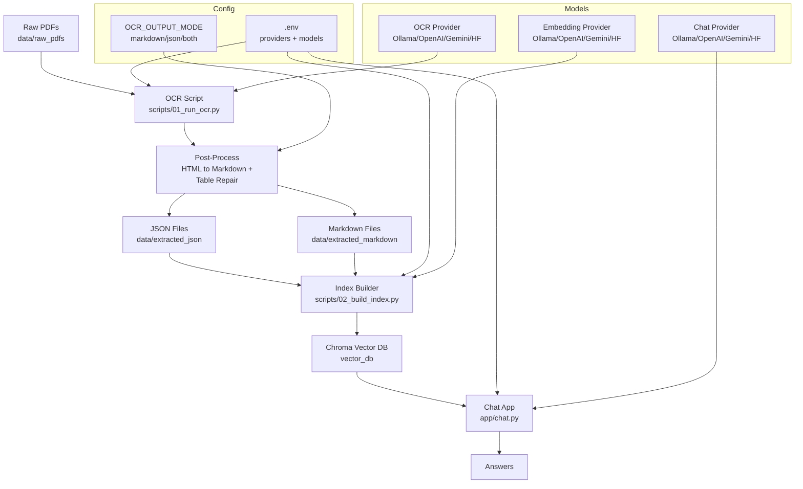

# Mortgage RAG

Local OCR + RAG pipeline for mortgage statements. The system extracts Markdown + JSON from PDFs, builds a layout-safe Chroma vector index, and answers questions with a configurable chat model. All providers and models are set via `.env`.

## Features
- OCR PDF pages into Markdown and JSON
- OCR output mode switch (`markdown`, `json`, or `both`)
- Table repair and HTML-to-Markdown cleanup after OCR
- Layout-safe indexing with MarkdownNodeParser
- Provider-agnostic OCR, embeddings, and chat (Ollama, OpenAI-compatible, Gemini, Hugging Face)
- .env-driven model and API configuration for OCR, embeddings, and chat
- Local embeddings with ChromaDB
- Streaming chat for fast Q&A

## System Diagram


## Setup
1) Create and activate a venv
2) Install dependencies

```bash
pip install -r requirements.txt
```

3) Install and start Ollama, then pull the models:

```bash
ollama pull Maternion/LightOnOCR-2:latest
ollama pull qwen3-embedding:0.6b
ollama pull qwen2.5:1.5b
```

## Configuration (.env)
Copy `.env.example` to `.env` and set providers/models as needed.

```env
OCR_PROVIDER=ollama
OCR_MODEL=maternion/LightOnOCR-2:latest
OCR_OUTPUT_MODE=json
EMBED_PROVIDER=ollama
EMBED_MODEL=qwen3-embedding:0.6b
CHAT_PROVIDER=ollama
CHAT_MODEL=qwen2.5:1.5b
```

OpenAI-compatible example:

```env
OCR_PROVIDER=openai
OCR_MODEL=gpt-4o-mini
EMBED_PROVIDER=openai
EMBED_MODEL=text-embedding-3-small
CHAT_PROVIDER=openai
CHAT_MODEL=gpt-4o-mini
OPENAI_API_KEY=your_key
```

Gemini example:

```env
OCR_PROVIDER=gemini
OCR_MODEL=gemini-2.0-flash
EMBED_PROVIDER=gemini
EMBED_MODEL=embedding-001
CHAT_PROVIDER=gemini
CHAT_MODEL=gemini-2.0-flash
GEMINI_API_KEY=your_key
```

Supported providers for OCR/embeddings/chat:
- `ollama`
- `openai` (OpenAI-compatible)
- `openrouter` (OpenAI-compatible)
- `groq` (OpenAI-compatible)
- `grok` (OpenAI-compatible)
- `gemini`
- `huggingface`

For OpenAI-compatible providers, you can set `OPENAI_BASE_URL` or the specific `OCR_API_BASE`, `EMBED_API_BASE`, and `CHAT_API_BASE` overrides.
For OCR providers that return JSON, the pipeline extracts `raw_markdown` automatically.
OCR output mode can be set with `OCR_OUTPUT_MODE` to `markdown`, `json`, or `both`.

## Usage
### 1) OCR PDFs to Markdown + JSON
Place PDFs in `data/raw_pdfs`, then run:

```bash
python scripts/01_run_ocr.py
```

Outputs go to `data/extracted_markdown`, `data/extracted_json`, or both based on `OCR_OUTPUT_MODE`.

### 2) Build the Vector Index
Indexing prefers JSON when present and falls back to Markdown.

```bash
python scripts/02_build_index.py
```

### 3) Start the Chat App

```bash
python app/chat.py
```

## Example
Example question and response after indexing a mortgage statement:

```text
You: What is the account number?
AI: Account number 1234512789090.
```

## Notes
- GPU VRAM is limited; the default models are chosen to stay lightweight.
- OCR emits Markdown and JSON; JSON is preferred for indexing when available.
- Indexing uses a Markdown-aware parser to keep tables intact.
- If OCR quality is poor, try a different OCR model in `.env` and re-run `scripts/01_run_ocr.py`.
