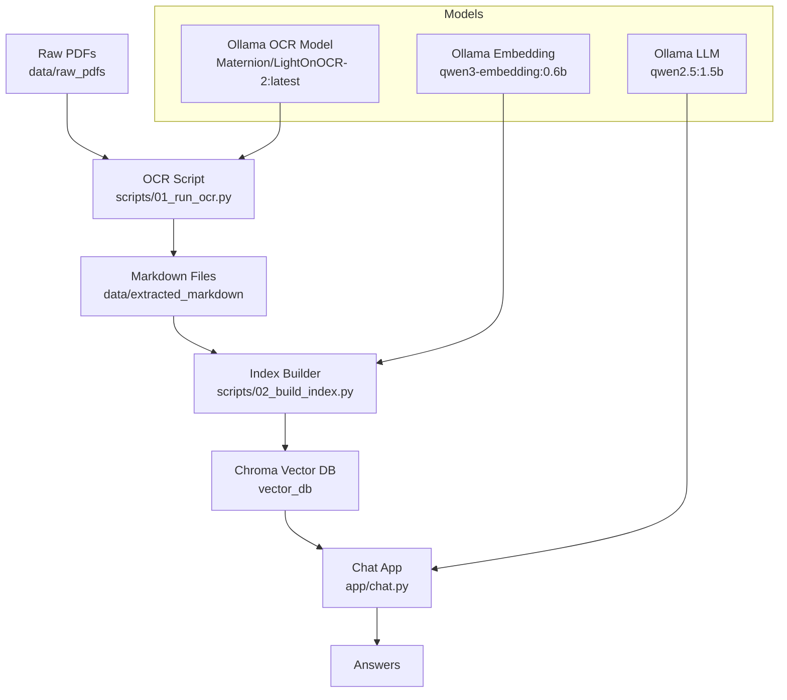

# Mortgage RAG

Local OCR + RAG pipeline for mortgage statements. The system extracts Markdown from PDFs, builds a Chroma vector index, and answers questions with a lightweight Ollama LLM.

## Features
- OCR PDF pages into Markdown
- Local embeddings with ChromaDB
- Streaming chat for fast Q&A

## System Diagram


## Setup
1) Create and activate a venv
2) Install dependencies

```bash
pip install -r requirements.txt
```

3) Install and start Ollama, then pull the models:

```bash
ollama pull Maternion/LightOnOCR-2:latest
ollama pull qwen3-embedding:0.6b
ollama pull qwen2.5:1.5b
```

## Usage
### 1) OCR PDFs to Markdown
Place PDFs in `data/raw_pdfs`, then run:

```bash
python scripts/01_run_ocr.py
```

Outputs go to `data/extracted_markdown`.

### 2) Build the Vector Index

```bash
python scripts/02_build_index.py
```

### 3) Start the Chat App

```bash
python app/chat.py
```

## Example
Example question and response after indexing a mortgage statement:

```text
You: What is the loan number?
AI: Loan number 123456789.
```

## Notes
- GPU VRAM is limited; the default models are chosen to stay lightweight.
- If OCR quality is poor, try a different Ollama vision model and update `scripts/01_run_ocr.py`.
